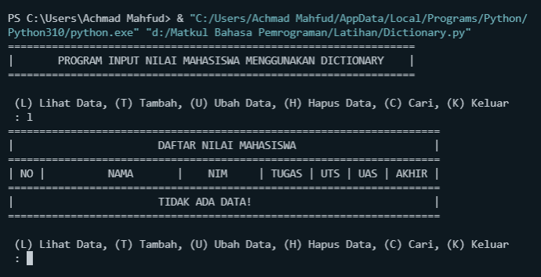
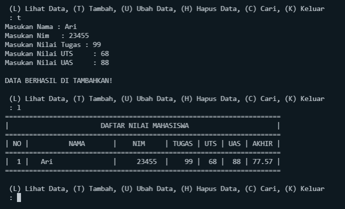
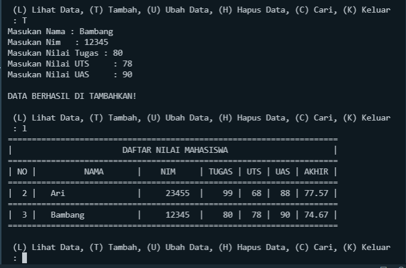
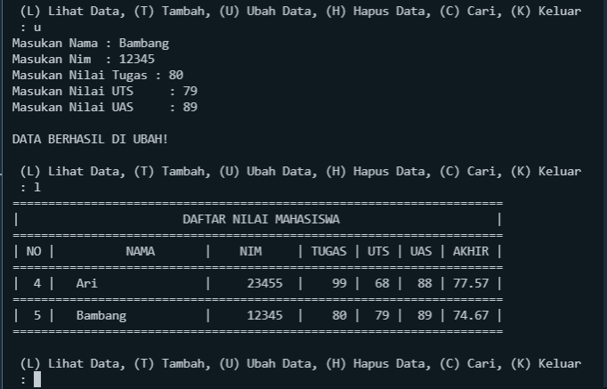
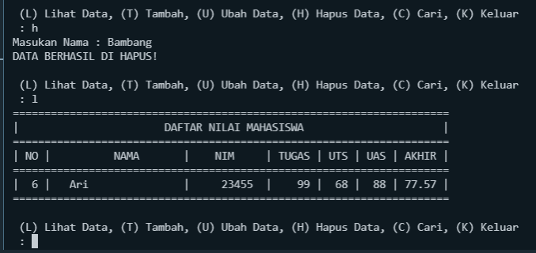
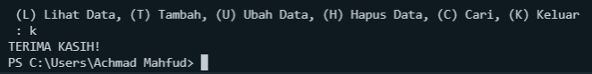

# **Program Dictionary**
## **Tugas Praktikum**
___

### *Perintah :*
Buat program sederhana yang akan menampilkan daftar nilai
mahasiswa, dengan ketentuan :
1. Program dibuat dengan menggunakan Dictionary.
2. Tampilkan menu pilihan: (Tambah Data, Ubah Data, Hapus Data,
Tampilkan Data, Cari Data).
3. Nilai Akhir diambil dari perhitungan 3 komponen nilai (tugas: 30%,
uts: 35%, uas: 35%).
4. Buat flowchart dan penjelasan programnya pada README.md.
5. Commit dan push repository ke github.
   
### *[Program](program/Dictionary.py) :*
```sh
dataMahasiswa = {}
no = 0
print("=" * 65)
print("|\tPROGRAM INPUT NILAI MAHASISWA MENGGUNAKAN DICTIONARY\t|")
print("=" * 65)
while True:
    data = input(
        "\n (L) Lihat Data, (T) Tambah, (U) Ubah Data, (H) Hapus Data, (C) Cari, (K) Keluar \n : "
    )
    if (data.lower() == 't'):
        nama = str(input("Masukan Nama : "))
        nim = int(input("Masukan Nim   : "))
        tugas = int(input("Masukan Nilai Tugas : "))
        uts = int(input("Masukan Nilai UTS     : "))
        uas = int(input("Masukan Nilai UAS     : "))
        akhir = (tugas / 3) + (uts / 3.5) + (uas / 3.5)
        dataMahasiswa[nama] = nim, tugas, uts, uas, akhir, no
        print("\nDATA BERHASIL DI TAMBAHKAN!")
    elif (data.lower() == 'u'):
        nama = str(input("Masukan Nama : "))
        if nama in dataMahasiswa.keys():
            nim = int(input("Masukan Nim  : "))
            tugas = int(input("Masukan Nilai Tugas : "))
            uts = int(input("Masukan Nilai UTS     : "))
            uas = int(input("Masukan Nilai UAS     : "))
            akhir = (tugas / 3) + (uts / 3.5) + (uas / 3.5)
            dataMahasiswa[nama] = nim, tugas, uts, uas, akhir
            print("\nDATA BERHASIL DI UBAH!")
        else:
            print("\DATA TIDAK DI TEMUKAN!")
    elif (data.lower() == 'h'):
        nama = str(input("Masukan Nama : "))
        if nama in dataMahasiswa:
            del dataMahasiswa[nama]
            print("DATA BERHASIL DI HAPUS!")
        else:
            print("DATA TIDAK DI TEMUKAN ".format(nama))
    elif (data.lower() == 'l'):
        if dataMahasiswa.items():
            print("=" * 69)
            print("|" + "\t" * 3 + "DAFTAR NILAI MAHASISWA" + "\t" * 3 +
                  "    |")
            print("=" * 69)
            print("| NO |   \tNAMA\t   |\tNIM \t| TUGAS | UTS | UAS | AKHIR |")
            print("=" * 69)
            for tampil in dataMahasiswa.items():
                no += 1
                print(
                    "| {6:2} |\t {0:15}   | {1:9} \t| {2:5} | {3:3} | {4:3} | {5:5} |"
                    .format(tampil[0], tampil[1][0], tampil[1][1],
                            tampil[1][2], tampil[1][3],
                            "%.2f" % float(tampil[1][4]), no))
                print("=" * 69)
        else:
            print("=" * 69)
            print("|" + "\t" * 3 + "DAFTAR NILAI MAHASISWA" + "\t" * 3 +
                  "    |")
            print("=" * 69)
            print("| NO |   \tNAMA\t   |\tNIM \t| TUGAS | UTS | UAS | AKHIR |")
            print("=" * 69)
            print("|    " + "\t" * 3 + "TIDAK ADA DATA!" + "\t" * 4 + "    |")
            print("=" * 69)
    elif (data.lower() == 'c'):
        nama = str(input("Masukan Nama : "))
        if nama in dataMahasiswa.keys():
            print("=" * 61)
            print("|" + "\t" * 2 + "DAFTAR NILAI MAHASISWA" + "\t" * 3 +
                  "    |")
            print("=" * 61)
            print("|\tNAMA \t|\tNIM \t| TUGAS | UTS | UAS | AKHIR |")
            print("=" * 61)
            print(
                "| {6:2} | {0:12}  | {1:9} \t| {2:5} | {3:3} | {4:3} | {5:5} |"
                .format(nama, nim, tugas, uts, uas, "%.2f" % float(akhir), no))
            print("=" * 61)
        else:
            print("DATA {0} TIDAK DI TEMUKAN ".format(nama))
    elif (data.lower() == 'k'):
        print("TERIMA KASIH! ")
        exit()
    else:
        print("PILIHAN MENU TIDAK ADA!")
```

### *Penjelasan :*
1. Perintah ***L*** untuk melihat data.
2. Perintah ***T*** untuk menambah data.
3. Perintah ***U*** untuk merubah data.
4. Perintah ***H*** untuk menghapus data.
5. Perintah ***C*** untuk mencari data.
6. Perintah ***K*** untuk keluar.

### *Flowchart :*


### *Output Program :*

**Output saat melihat data :** 
>Menggunkan perintah " L "



**Output saat tambah data :** 
>Menggunakan Perintah " T "





**Output saat merubah data :**
>Menggunakan perintah " U "



**Output saat menghapus data :**
>Menggunakan perintah " H "



**Output saat keluar program :**
>Menggunkan perintah " K "


